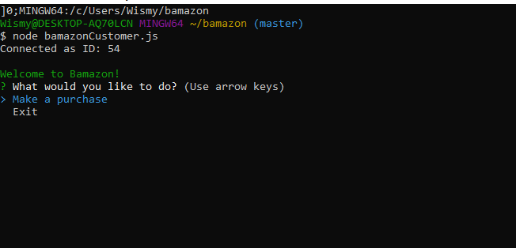
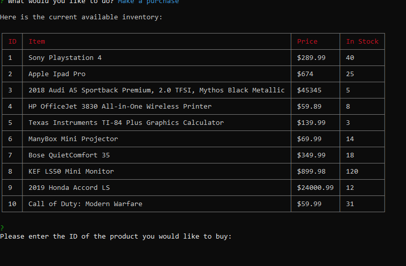
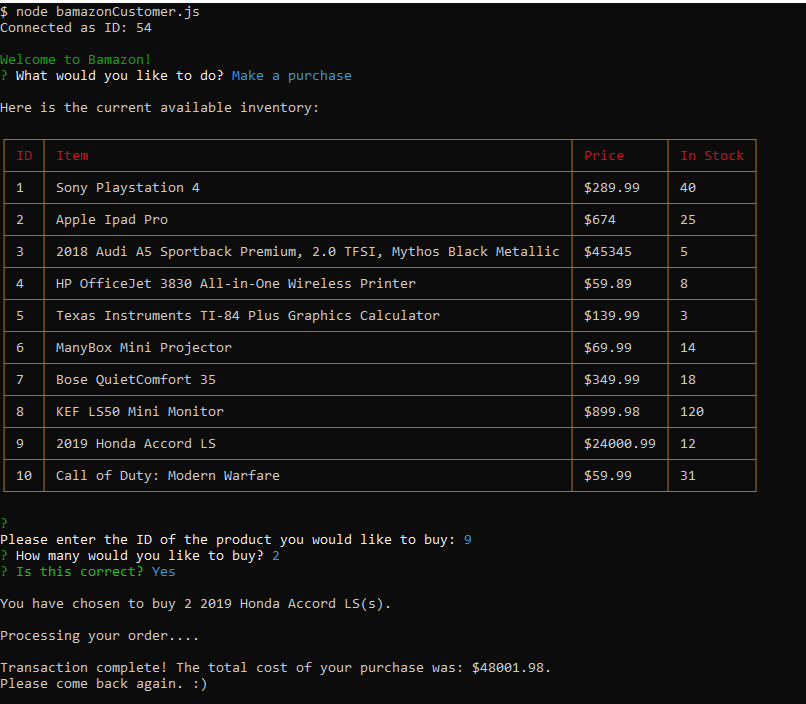

# Bamazon
##### By **Wismy Seide**

### What It Does

Shopping command line where NodeJS and MySQL come together to purchase items as a customer or view, track, and update inventory

This app uses Node.js.  Installation of the following will be needed using *npm install* from the command line to install:

* MySQL
* inquirer
* cli-table3
* chalk

After you have the downloads of the npm packages installed on your computer, you will be able to run bamazon in your terminal. Type node bamazonCustomer.js. This will run the bamazon application.  By making a purchase Bamazon will search the database of the iventory and display the items in stock.

Link to Demo:

<a href="https://drive.google.com/file/d/1K8kBCpZl4dZ2Ryp2fcG00vq61-gN_j5B/view">Link to Demo</a> 

Example:

Technologies Used:
* Javascript
* Node.js
* MySQL
* NPM Packages
